# Schedule Compare Workflow

## Overview
The Schedule Compare feature allows users to analyze and compare their calendar events with schedules from uploaded images to find common free time slots.

## Complete Workflow Diagram


## Key Components

### Frontend Components
- **ScheduleCompare.tsx**: Main page component orchestrating the workflow
- **useAiScheduleCompare.ts**: Custom hook managing state and API calls
- **scheduleCompare.ts (API)**: Client-side API interface

### Backend Components
- **scheduleCompare.ts (Endpoint)**: Express router handling requests
- **scheduleExtraction.ts (Service)**: AI vision integration for event extraction

### Data Flow
1. **User Input**: Date selection, event filters, image upload
2. **AI Analysis**: Vision model extracts structured event data
3. **Event Processing**: Merge, sort, and validate events
4. **Free Slot Calculation**: Identify gaps between events within work hours
5. **User Review**: Edit/confirm extracted events
6. **Results Display**: Show common free time with visual timeline

## Features
- **Dual Mode**: Manual entry or AI-powered image analysis
- **Event Editing**: Full CRUD operations on extracted events
- **Smart Filtering**: Option to exclude all-day events
- **Work Hours**: Configurable work day boundaries
- **Action Logging**: Integration with agentic action context for tracking

---

## Network Architecture & Communication Flow

```mermaid
sequenceDiagram
    participant User as 👤 User Browser
    participant UI as React UI<br/>(ScheduleCompare.tsx)
    participant Hook as Custom Hook<br/>(useAiScheduleCompare.ts)
    participant API as API Client<br/>(scheduleCompare.ts)
    participant Axios as Axios HTTP Client
    participant Server as Express Server<br/>(Port 3000)
    participant Router as Schedule Router<br/>(/api/schedule/compare)
    participant Multer as Multer Middleware<br/>(File Upload)
    participant Service as AI Service<br/>(scheduleExtraction.ts)
    participant AI as External AI API<br/>(gemma3-27b)
    participant FS as File System<br/>(uploads/)

    User->>UI: 1. Upload Image & Click Analyze
    UI->>Hook: 2. handleAnalyzeSchedule()
    
    Note over Hook: Validate image exists<br/>Prepare event data
    
    Hook->>API: 3. compareScheduleWithImage(file, date, events, workHours)
    
    Note over API: Build FormData:<br/>- image: File<br/>- data: JSON string
    
    API->>Axios: 4. POST /api/schedule/compare<br/>Content-Type: multipart/form-data
    
    rect rgb(200, 220, 250)
        Note over Axios,Server: HTTP Request Over Network
        Axios-->>Server: FormData with image + metadata
    end
    
    Server->>Router: 5. Route to /schedule/compare
    Router->>Multer: 6. Process multipart upload
    
    Multer->>FS: 7. Save image to uploads/
    FS-->>Multer: File path
    Multer-->>Router: 8. req.file populated
    
    Router->>Router: 9. Validate request<br/>(image, date, myEvents)
    
    Router->>FS: 10. Read uploaded image
    FS-->>Router: Image buffer
    
    Router->>Router: 11. Convert to base64<br/>Create data URL
    
    Router->>Service: 12. extractEventsFromScheduleImage(imageDataUrl)
    
    rect rgb(255, 240, 200)
        Note over Service,AI: External AI API Call
        Service->>AI: 13. POST /api/chat/completions<br/>{<br/>  model: "gemma3-27b",<br/>  messages: [vision prompt + image]<br/>}
        AI->>AI: 14. Process image with vision model
        AI-->>Service: 15. JSON response with events
    end
    
    Service->>Service: 16. Parse & clean JSON response
    Service-->>Router: 17. Array of extracted events
    
    Router->>Router: 18. Format events to ISO DateTime
    Router->>Router: 19. Merge myEvents + extractedEvents
    Router->>Router: 20. Sort events by start time
    Router->>Router: 21. Calculate free slots algorithm
    Router->>Router: 22. Calculate total free hours
    
    Router->>FS: 23. Delete uploaded image file
    FS-->>Router: Cleanup complete
    
    rect rgb(240, 200, 250)
        Note over Router,Axios: HTTP Response Over Network
        Router-->>Axios: 24. JSON Response:<br/>{<br/>  success: true,<br/>  extractedEvents: [...],<br/>  freeSlots: [...],<br/>  totalFreeHours: X<br/>}
    end
    
    Axios-->>API: 25. Response data
    API-->>Hook: 26. CompareScheduleResponse
    
    Hook->>Hook: 27. Update state:<br/>- extractedEvents<br/>- editableExtractedEvents<br/>- commonFreeSlots
    
    Hook->>Hook: 28. Record action to context
    Hook-->>UI: 29. State updated (triggers re-render)
    UI-->>User: 30. Display extracted events & free slots
```



## Network Layer Details

### Client Side (Frontend)

#### API Client Configuration
- **Base URL**: Configured via Axios instance in `client.ts`
- **Headers**: Automatically set `Content-Type: multipart/form-data`
- **Error Handling**: Try-catch with console logging and error propagation

#### Request Payload Structure
```typescript
FormData {
  image: File,                    // Binary image file
  data: JSON.stringify({          // Stringified JSON
    date: "2025-12-05",
    myEvents: [
      {
        title: "Meeting",
        start_time: "2025-12-05T09:00:00",
        end_time: "2025-12-05T10:00:00"
      }
    ],
    workStartHour: 9,
    workEndHour: 17
  })
}
```

### Server Side (Backend)

#### Endpoint Configuration
- **Route**: `POST /api/schedule/compare`
- **Middleware**: 
  - `uploadScheduleImage.single('image')` - Multer file upload
  - File saved to `uploads/` directory with unique filename
- **File Handling**: Automatic cleanup after processing

#### Response Structure
```typescript
{
  success: boolean,
  extractedEvents: [
    {
      title: string,
      start_time: string,        // ISO 8601 format
      end_time: string          // ISO 8601 format
    }
  ],
  freeSlots: [
    {
      start: string,            // ISO 8601 format
      end: string              // ISO 8601 format
    }
  ],
  totalFreeHours: number
}
```

### External AI Integration

#### AI API Configuration
- **Base URL**: `process.env.AI_BASE_URL` (default: `https://ai-snow.reindeer-pinecone.ts.net`)
- **Authentication**: `Bearer ${process.env.OPENWEBUI_API_KEY}`
- **Model**: `gemma3-27b` (vision-capable model)
- **Temperature**: `0.1` (low for consistent extraction)

#### AI Request Format
```typescript
{
  model: "gemma3-27b",
  messages: [
    {
      role: "user",
      content: [
        { 
          type: "text", 
          text: "Extract events from calendar image..." 
        },
        { 
          type: "image_url", 
          image_url: { 
            url: "data:image/png;base64,..." 
          }
        }
      ]
    }
  ],
  temperature: 0.1
}
```

#### AI Response Format
```json
[
  {
    "title": "Team Meeting",
    "startTime": "09:00",
    "endTime": "10:00",
    "date": "2025-12-05"
  }
]
```

## Error Handling & Network Resilience

### Client Side
- **Upload Validation**: Check file exists before API call
- **Toast Notifications**: User-friendly error messages
- **Loading States**: `isAnalyzing` flag during network operations
- **Error Propagation**: Catch and log errors with context

### Server Side
- **Request Validation**: Check for required fields (image, date, myEvents)
- **File Cleanup**: Always delete uploaded files (success or failure)
- **AI Fallback**: Return empty array `[]` if AI call fails
- **Error Responses**: Structured error objects with details

### Network Considerations
- **File Size**: Large images increase upload time
- **Timeouts**: AI vision processing can take several seconds
- **CORS**: Must be configured for cross-origin requests
- **Content-Type**: Proper multipart/form-data boundary handling
